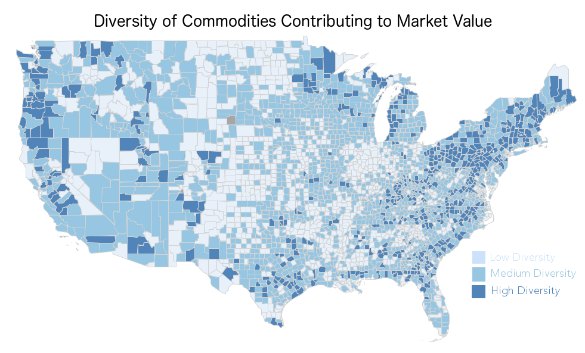

 

```{r, cache=FALSE, include=FALSE}
setwd("/Users/yangjy/Desktop/farmviz/agvis.github.io/")

library("tigris")
library("leaflet")
library("scales")
library("stringr")

grassgreens9 = c("#FBFFF7","#EBF7DE","#DBEFC6","#CAE19E",
	"#AED66B","#92C642","#71B521","#519C08","#306B08")
purples9 = c("#FBF7FF","#EBDEF7","#DBC6EF","#CA9EE1","#AE6BD6",
	"#9242C6","#7121B5","#51089C","#30086B")
golds9 = c("#FFFBF7","#F7EBDE","#EFDBC6","#E1CA9E","#D6AE6B",
	"#C69242","#B57121","#9C5108","#6B3008")
reds9 = c("#FFF7FB","#F7DEEB","#EFC6DB","#E19ECA","#D66BAE",
	"#C64292","#B52171","#9C0851","#6B0830")
seagreens9 = c("#F7FFFB","#DEF7EB","#C6EFDB","#9EE1CA","#6BD6AE",
	"#42C692","#21B571","#089C51","#086B30")

entropy = function(p){
	p = p[p!=0]
	-sum(p*log(p))
}

color.groups = function(z, col = blues9, 
zlim = c(min(z, na.rm = TRUE), max(z, na.rm = TRUE))){
    breaks <- seq(zlim[1], zlim[2], length = length(col) + 1)
    zgroups <- cut(z, breaks = breaks, labels = FALSE,
    include.lowest = TRUE)
    return(col[zgroups])
}

# counties = counties(cb=TRUE)
# states = states(cb=TRUE)
load("countiesAndStates.RData")

agdata = read.csv("countyagsummary2012.csv",stringsAsFactors=FALSE)
agdata$GEOID = str_pad(agdata$GEOID,5,"left",pad="0")

farmmap = geo_join(counties,agdata,"GEOID","GEOID")

ncomm = 17

maxDiffColors = c(c("#E41A1C","#0000FF","#00FF00","#FFA500","#E7298A",
                    "#000080","#00FFFF","#008000","#800080","#008080",
                    "#FFFF00","#800000","#A65628","#F781BF","#1B9E77",
                    "#808000","#4DAF4A","#377EB8","#FF4500","#505050")[
                      c(15,2,3,6,18,8,10,16,9,12,19,1,4,5,11,13,20)])

commCols = maxDiffColors[1:ncomm]
```

<br/>

# Chewing it Over

Agriculture in the United States has become so productive that now, we often take it for granted. Chances are, you can enjoy three meals a day at a reasonable price without having to think too long about how to cultivate, raise or process your food. Yet only [1.4% of the US population](link: https://www.ers.usda.gov/data-products/ag-and-food-statistics-charting-the-essentials/ag-and-food-sectors-and-the-economy/) work directly in farming. How is this possible? Perhaps this topic merits some thought. Is this sustainable? What are some issues and challenges present in farming today?

# The Hollowing Out of Midsized Farms

Between 2007 to 2012, most counties in America experienced farm consolidation. With the map below, we can explore which counties have experienced farm consolidation, expansion, partitioning and decline. 

```{r echo=FALSE, warning=FALSE, message=FALSE, cache=TRUE, eval=TRUE, fig.align='center'}
hue = 8
a = log2(farmmap@data$Average.Size.of.Farm/farmmap@data$Average.Size.of.Farm.07)
b = log2(farmmap@data$Number.of.Farms/farmmap@data$Number.of.Farms.07)
d = log2(farmmap@data$Land.in.Farms/farmmap@data$Land.in.Farms.07)
quadrants = ((a<0)*0 + (a==0)*1 + (a>0)*2)*1 + ((b>0)*0 + (b==0)*1 + (b<0)*2)*3 + 1
quadcolors = c(colorRampPalette(c("#008AB8",blues9[hue]))(3)[2], # 
	       purples9[hue],
	       purples9[hue],
	       colorRampPalette(c("#FFCC33",golds9[hue]))(3)[2], 
	       "#FFFFFF",
	       purples9[hue],
	       colorRampPalette(c("#FFCC33",golds9[hue]))(3)[2], # 
	       "#DA9E2A",
	       colorRampPalette(c("#CC3333",reds9[hue]))(3)[2])
quadCols = quadcolors[quadrants]
quadCols[is.na(quadCols)] = "#D3D3D3"

```

```{r out.width = "100%", echo=FALSE, warning=FALSE, message=FALSE, cache=TRUE, eval=TRUE}
m.labels = lapply(paste(farmmap@data$county,", ",farmmap@data$state,
				" <br/>Average Farm Size Change: ",round(2^a*100)/100," x",
				" <br/>Number of Farms Change: ",round(2^b*100)/100," x",sep=""),
				htmltools::HTML)

m = leaflet(farmmap) %>% setView(-96,37.8,4.2)
m = m %>% addPolygons(
		  fillColor = quadCols,
		  label = m.labels,
		  weight = 0.2,
		  opacity = 1,
		  color = "#D3D3D3",
		  fillOpacity = 0.9) %>%
		  addPolylines(data=states,col="#E3E3E3",weight=0.7,opacity = 1) %>%
	  	  addLegend(colors = quadcolors[c(9,1,7,3)], opacity = 1,
			      labels = c("Farm Consolidation","Farm Partitioning",
					 "Ag Land Decline","Ag Land Expansion"), title = NULL, position = "bottomright")
m
```
<!--<iframe class="mapframe" frameborder="0" scrolling="no" seamless="" style="float: left; width: 100%;" height=450pt src="leafletMaps/farmLandChange2.html"></iframe>-->

<div style="width: 100%;">
<div style="width: 55%; float: left;">
```{r fig.width=5.3, fig.height=5.3, out.width = "100%", echo=FALSE, warning=FALSE, message=FALSE, cache=TRUE, eval=TRUE, fig.align='center'}

par(mar=c(4,4,4,3))
plot(a, b,cex=0.7,xlim=c(-1,1),ylim=c(-1,1),
     xlab="Fold Change in Average Farm Size", ylab="Fold Change in Number of Farms",
     main="Grouping Farm Land Changes",col=quadcolors[quadrants],xaxt="n",yaxt="n")
abline(h=0,lty=2)
abline(v=0,lty=2)
axis(1,at=c(-1,0,1),labels=c("Halved","No Change","Doubled"))
axis(2,at=c(-1,0,1),labels=c("Halved","No Change","Doubled"))

textsize = 0.8
qcounts = table(quadrants)
legend("topleft",legend=paste(qcounts[1]," counties experienced\n",sep=""),
       bty="n",text.col=quadcolors[1],cex=textsize)
legend("topright",legend=paste(qcounts[2]+qcounts[3]+qcounts[6]," counties experienced\n",sep=""),
       bty="n",text.col=quadcolors[3],cex=textsize)
legend("bottomleft",legend=paste(qcounts[4]+qcounts[7]+qcounts[8]," counties experienced\n",sep=""),
       bty="n",text.col=quadcolors[7],cex=textsize)
legend("bottomright",legend=paste(qcounts[9]," counties experienced\n",sep=""),
       bty="n",text.col=quadcolors[9],cex=textsize)

legend("topleft",legend="\nFarm Partitioning",
       bty="n",text.col=quadcolors[1],text.font=2,cex=textsize)
legend("topright",legend="\nAgricultural Land Expansion",
       bty="n",text.col=quadcolors[3],text.font=2,cex=textsize)
legend("bottomleft",legend="\nAgricultural Land Decline",
       bty="n",text.col=quadcolors[7],text.font=2,cex=textsize)
legend("bottomright",legend="\nFarm Consolidation",
       bty="n",text.col=quadcolors[9],text.font=2,cex=textsize)

```
</div>
<div style="width: 45%; float: left;">

<br/><br/>
The colors in the plot to the left corresponds to the coloring of the counties in the map above. Here, we define farm consolidation (red) to mean that the number of farms decreased in that county while the average farm sizes increased. On the other hand, farm partitioning (blue) means that the number of farms increased while the average farm sizes decreased. Counties where both farm size and farm number increased we classify as having experienced agricultural land expansion, and counties where both farm size and farm number decreased we classify as having experienced agricultural land decline.

</div>
<br style="clear: left;" />
</div>

This trend toward farmland consolidation is not limited to between 2007 and 2012. In the [last few decades](http://ota.fas.org/reports/8633.pdf), arguably, the most striking trend in U.S. agriculture is the shift in farm sizes. While the average is about 250 acres and has not changed much, there seems to be a ["hollowing out"](https://fivethirtyeight.com/features/big-farms-are-getting-bigger-and-most-small-farms-arent-really-farms-at-all/) of the midsized farms, and a shift toward the two extremes. Small farms fluctuate in number, and large farms are growing to monolithic sizes.


Data Source: USDA

Advances in technology has allowed large industrial operations to excel at producing large quantities of one product efficiently, and so large farms can achieve economies of scale more readily. The cost of these technologies has made it very difficult for midsized farms to compete. But at what point is large too large? Have certain regions of the US already hit this point? While this is a very rough graph, the answer is likely, yes, farm sizes in some regions of the United States may already be beyond the point of diminishing returns. Bigger may not always better.

```{r fig.width=9.5, fig.height=4.5, out.width = "100%", echo=FALSE, warning=FALSE, message=FALSE, cache=TRUE, eval=TRUE, fig.align='center'}
layout(matrix(1:2,ncol=2),widths=c(1.5,1))
par(mar=c(4,4,4,3))
plot(log10(agdata$Average.Size.of.Farm),log10(agdata$Market.Value.of.Products.Sold),
     col=commCols[agdata$dominantcomm],
     xlim=c(1,max(log10(agdata$Average.Size.of.Farm),na.rm=TRUE)),
     ylim=c(4.5,max(log10(agdata$Market.Value.of.Products.Sold),na.rm=TRUE)),
     xlab = "log10(Average Acres Per Farm in County)",
     ylab="log10(Market Value of Products Sold)",main="Market Value vs. Farm Size Per County")
par(mar=c(4,0,4,3))
plot(0,0,col=0,xaxt="n",yaxt="n",bty="n",xlab="",ylab="",main="")
legend("left",legend=gsub("\\.+"," ",colnames(agdata)[4:(4+ncomm-1)]),
       pch=15,col=commCols,cex=0.75,pt.cex=1.6,bty="n")

```

Even if bigger is not always better, can bigger be worse? Do we lose anything by losing midsized farms? Since large farms gain efficiency through monocultures, counties with smaller farms tend to be more diverse than counties with large farms.The loss of small and midsized farms may mean less diversity, but why should diversity matter?  

```{r fig.width=9.5, fig.height=4.5, out.width = "100%", echo=FALSE, warning=FALSE, message=FALSE, cache=TRUE, eval=FALSE, fig.align='center'}
layout(matrix(1:2,ncol=2),widths=c(1.7,1))
par(mar=c(4,4,4,3))
plot(log10(agdata$Average.Size.of.Farm),agdata$farmentropy,
     col=commCols[agdata$dominantcomm],
     xlim=c(1,max(log10(agdata$Average.Size.of.Farm),na.rm=TRUE)),
     xlab = "log10(Average Acres Per Farm in County)",
     ylab="County Commodity Diversity",main="Size of Farms Limits Diversity of Commodities")
par(mar=c(4,0,4,3))
plot(0,0,col=0,xaxt="n",yaxt="n",bty="n",xlab="",ylab="",main="")
legend("left",legend=gsub("\\.+"," ",colnames(agdata)[4:(4+ncomm-1)]),
       pch=15,col=commCols,cex=0.75,pt.cex=1.6,bty="n")

```


##  Diversity of commodities

[Diversification](link: https://en.wikipedia.org/wiki/Diversification_(finance)) is a strategy for spreading out risk. For example, if, as a farmer, you grew only corn and had a corn rootworm pest outbreak, you run the risk of losing all your crop that year. An extreme example of this is the Irish Potato Famine. If you diversify you reduce the impact that the pest outbreak can have, and, thus, lower your exposure to risk. So from a risk perspective, a community that produces a diverse medley of products is more resilient to various shocks.

We mapped diversity using the Shannon diversity index and the major contributing products to the agricultural market value of each county. This can be thought of as how uniformly, or how evenly, commodities contribute toward total market value. A high value represents more diversity while a low number suggest a tendency to monoculture. What's the top commodity produced in your county? 

```{r out.width = "100%", echo=FALSE, warning=FALSE, message=FALSE, cache=TRUE, eval=TRUE}
# maximum entropy in this case is log(1/ncomm)
nbins = 7
colorMatrix = sapply(commCols,function(x){
  colorRampPalette(c(x,"#FFFFFF"))(nbins+1)[-(nbins+1)]
})

diversitycomm = colorMatrix[
  cbind(as.numeric(cut(farmmap@data$farmentropy,nbins)),farmmap@data$dominantcomm)]

m.labels = lapply(paste(farmmap@data$county,", ",farmmap@data$state,
				" <br/>Top Commodity: ",gsub("\\.+"," ",colnames(agdata)[4:(4+ncomm-1)][farmmap@data$dominantcomm]),
				" <br/>Commodity Diversity: ",round(farmmap@data$farmentropy*100)/100,sep=""),
				htmltools::HTML)

m = leaflet(farmmap) %>% setView(-96,37.8,4.2)
m = m %>% addPolygons(
		  fillColor = diversitycomm,
		  label = m.labels,
		  weight = 0.5,
		  opacity = 1,
		  color = "#D3D3D3",
		  fillOpacity = 0.9)  %>%
		  addPolylines(data=states,col="#E3E3E3",weight=0.7,opacity = 1)
m
```
<!--<iframe class="mapframe" frameborder="0" scrolling="no" seamless="" width=100% height=450pt src="leafletMaps/diversity2.html"></iframe>-->

```{r fig.width=7, fig.height=1.8, out.width = "65%", echo=FALSE, warning=FALSE, message=FALSE, cache=TRUE, eval=TRUE, fig.align='center'}
layout(matrix(c(1,2),ncol=2),widths=c(1,1))
par(mar=c(0,0,0,1))
plot(0,0,col=0,xaxt="n",yaxt="n",bty="n",xlab="",ylab="",main="")
legend("left",legend=gsub("\\.+"," ",colnames(agdata)[4:11]),
       pch=15,col=commCols[1:8],cex=0.75,pt.cex=1.6,bty="n")
par(mar=c(0,1,0,0))
plot(0,0,col=0,xaxt="n",yaxt="n",bty="n",xlab="",ylab="",main="")
legend("right",legend=gsub("\\.+"," ",colnames(agdata)[11:18]),
       pch=15,col=commCols[9:16],cex=0.75,pt.cex=1.6,bty="n")
```

<div id="right">
 
</div>

The color of the county corresponds to the dominant commodity (in contribution toward market value). The saturation corresponds to the diversity of commodities in the county. The more saturated the color, the closer the county is to a monoculture. In the map above, we can see a large swath of green that corresponds to the corn belt, and the large brown patch shows the pasturelands. A greyscale version of the map is shown on the right. Dark regions identify regions of high diversity and light regions have low diversity.

The diversity metric shows how dependent a county is on one product, which has implications for how resilient the community is to price shocks. Low shannon diversity can be thought of as how dependent a county is on one product. To provide some more intuition about the diversity metric, here is an example of two counties on the extreme ends of diversity:

```{r fig.width=10, fig.height=3, out.width = "80%", echo=FALSE, warning=FALSE, message=FALSE, cache=TRUE, eval=TRUE, fig.align='center'}
toPick = agdata$county%in%c("Box Elder","Elko")
excounties = t(as.matrix(agdata[toPick,4:19]))
# excounties = rbind(excounties,)
excounties = sweep(excounties,2,apply(excounties,2,sum,na.rm=TRUE),"/")
excounties[is.na(excounties)] = 0
layout(matrix(c(1,2),ncol=2),widths=c(1.3,1))
par(mar=c(2.5,7,5.5,0))
barplot(excounties,beside=FALSE,
	names.arg=paste(agdata$county[toPick],", ",agdata$state[toPick],
			"\n Diversity: ",round(agdata$farmentropy[toPick]*10)/10,sep=""),
	col=commCols,cex.axis=0.7,las=2,horiz=TRUE,xaxt="n")
title(main="Distribution of Commodities for\nHigh and Low Diversity Counties",cex.main=1)
par(mar=c(0,4,0,1))
plot(0,0,col=0,xaxt="n",yaxt="n",bty="n",xlab="",ylab="",main="")
legend("left",legend=gsub("\\.+"," ",colnames(agdata)[4:(4+ncomm-1)]),
       pch=15,col=commCols,cex=0.75,pt.cex=1.6,bty="n")
```

We should be especially concerned about agricultural diversity because the prices of commodities are known to be particularly volatile. This volatility happens because of particular charcteristics of supply and demand. For many crops, the supply depends on uncertain factors like weather and pests and the demand for that crop is rather fixed. For example, if the price of onions goes down, you are unlikely to respond by eating more onions. Therefore, an influx of onions on the market will be accompanied by a drastic fall in price. An interesting story of cornering the onion market can be heard [here](https://www.npr.org/sections/money/2015/10/14/448718171/episode-657-the-tale-of-the-onion-king). 

So diversification seems like a good strategy, it helps reduce and mitigate risks and provides consumers with more variety. However, from the diversity maps, we can see that counties across the U.S. skew toward monoculture. How do the current policies incentivize this?


## Government payments

The question is, what is the role of government payments? Should government payments (1) protect farmers against price shocks so that they don’t lose everything if a bad year hits? (2) incentivize farmers to produce enough food so that people don’t go hungry? (3) make sure that farms don’t overtake natural wildlife? The U.S Farm Bill encompasses all three goals. The bill helps codify crop insurance in the United States and has huge impact on what is grown, produced and eaten. The Farm Bill can be rather controversial. Some consider it “welfare for the well-off” and others highlight its importance to stable food supply. An interesting and detailed discussion of the farm bill can be found [here](https://www.farmaid.org/blog/farm-bill-101/) . Regardless of the view, we wanted to know who gets the subsidies?

In asking this question, we encountered the paradoxical situation that the largest amount of government payments happen to be going to areas with the highest market value of commodities. This is because the largest farms have the highest market value of commodities, but the largest farms also receive the highest amounts in government payments.

```{r fig.width=11, fig.height=5, out.width = "90%", echo=FALSE, warning=FALSE, message=FALSE, cache=TRUE, eval=TRUE, fig.align='center'}
layout(matrix(1:2,ncol=2),widths=c(1,1))
par(mar=c(4,4,4,3))
plot(log10(agdata$Market.Value.of.Products.Sold),log10(agdata$Government.Payments),
     col=commCols[agdata$dominantcomm],
     #xlim=c(1,max(log10(agdata$Average.Size.of.Farm),na.rm=TRUE)),
     ylab = "log10(Total Government Spending in County)",
     xlab="log10(Market Value of Products Sold)",main="Government Spending is Directly Tied to\nMarket Value of Products Sold")
par(mar=c(4,4,4,3))
plot(log10(agdata$Average.Size.of.Farm),agdata$farmentropy,
     col=commCols[agdata$dominantcomm],
     xlim=c(1,max(log10(agdata$Average.Size.of.Farm),na.rm=TRUE)),
     xlab = "log10(Average Acres Per Farm in County)",
     ylab="County Commodity Diversity",main="Farm Size Limits Diversity of\nCommodities Produced")
```

Additionally, some forms of government payments and insurance on specific commodities can incentivize large monoculture farms because the risk is no longer borne by the farmer. This can have another positive feedback effect where more insurance is needed to protect against instability of increasing monoculture.

Next, we mapped the data on two metrics:
1) government payments per farms in the county; and 
2) government payments per acre of farmland in the county. 


<div id="aside">
**Aside: What’s going on in Arizona?** In looking at the spending maps, Apache, Navajo and Coconino counties in Arizona all stood out. This region had low subsidies any way we cut it (government spending per acre or government spending per farm). Seemingly coincidentally, they were also high in diversity, medium sized farms, and parity in farmer genders. Why is this region such an outlier? It turns out that this is part of [Navajo Nation](link: https://fr.m.wikipedia.org/wiki/Fichier:Americanindiansmapcensusbureau.gif). 

The demographics of this region seems poorly matched with that of its representatives. And as a sovereign nation, it appears that either the government did not provide much ag subsidy or the Navajo Nation chose not to participate in the crop insurance. However, recently, [in 2016 and 2018](https://nativenewsonline.net/currents/crop-insurance-continues-to-yield-benefits-for-navajo-farmers/), the Navajo Nation did receive a [return](http://www.navajonationcouncil.org/pressReleases/2018/Feb/Agricultural_insurance_investment_earns_the_Navajo_Nation_over_$17_million_for_agricultural_infrastructure_projects.pdf) on purchased insurance. 
</div>

The resulting maps tell two different stories. Normalized by number of farms, the region with large farms gets most. On a per acre basis, the spending is highest in the [corn-belt](https://en.wikipedia.org/wiki/Corn_Belt#/media/File:Corn_belt.svg), which emphasizes that in America, [corn is king](https://grist.org/food/these-charts-show-why-corn-is-king/) - including king of subsides.

Despite these two metrics, some regions gain and lose regardless of the metric. Examples include east North Dakota, parts of Louisiana and Arkansa and regions in Arizona.

# What now?

Whether we think about it or not, we support agriculture, directly when we buy groceries or indirectly when we pay taxes, so perhaps every once in a while it's good to ask: What do we prefer to support:small diverse farms or large efficient farms? This debate about farm size is often posed as “small organic” versus “large industrial,” and each camp touts the advantages of its side: small diverse farms are better buffered against volatility in weather, prices, and pathogens. On the other hand, large industrial operations excel at producing large quantities of one product efficiently, and can achieve economies of scale more readily. Data from the 2017 Agricultural Census is set to be released in early 2019. We'll be waiting to see whether anything has changed.

In the meantime, at your next meal, we hope you'll ask yourself, does farm size matter? 

<br/>

### About the authors

<div style="width: 100%;">

<div style="width: 80%; float: left;" class="author">
Anjuli Jain Figueroa earned her BS in Civil and Environmental Engineering from University of Michigan, 2009, a MSc. Technology and Policy from MIT, 2012 and is currently working on her PhD in Civil and Environmental Engineering at MIT She studies the coupling of the built and the natural environment, in particular how we manage our natural resources (i.e water and land) and the economic and environmental impacts of different management strategies. Anjuli investigates the tradeoffs between yield, environmental impacts and economic costs of different agricultural management strategies. [[website](http://ajainf.mit.edu/)] | [[twitter](https://twitter.com/ajf_mi)]
</div>
<br style="clear: left; width: 100%;" />
</div>

<div style="width: 100%;"> 

<div style="width: 80%; float: left;" class="author">
Joy Yang graduated with a BA in Statistics from UC Berkeley. She is currently a PhD candidate in Computational and Systems Biology at MIT. Her research focuses on statistical methods for finding the genetic underpinnings for bacteriophage infections. She is broadly interested in methods for analyzing and visualizing large complex datasets. In her spare time, she likes to think about ways of making early statistics education more like fun and games. [[website](http://www.mit.edu/~yangjy/)] | [[twitter](https://twitter.com/ratatstats)]
</div>
<br style="clear: left; width: 100%;" />
</div>

<br/><br/><br/><br/>

<!-- Default Statcounter code for agvis.github.io
https://agvis.github.io/ -->
<script type="text/javascript">
var sc_project=11824471; 
var sc_invisible=1; 
var sc_security="dfc4ae05"; 
</script>
<script type="text/javascript"
src="https://www.statcounter.com/counter/counter.js"
async></script>
<noscript><div class="statcounter"><a title="Web Analytics"
href="http://statcounter.com/" target="_blank"></a></div></noscript>
<!-- End of Statcounter Code -->
